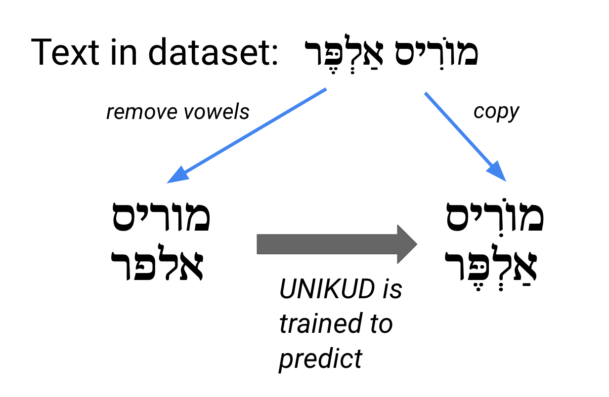
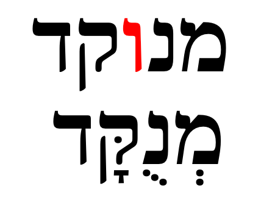
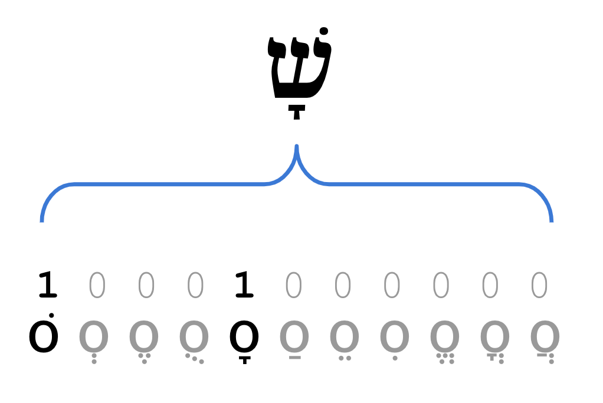

# UNIKUD: Hebrew nikud with transformers

If you are accessing this repo via GitHub, please see the [project page on DAGSHub](https://dagshub.com/morrisalp/unikud) for data files, pipelines and more.

# Description

We provide a short description of UNIKUD here. For more information, please see the article: (TBD)

*How Hebrew text with vowels is used to train UNIKUD. The text with vowels removed is used as the model's input, and the original text with vowels is used as the target (what we are trying to predict).*

*"Ktiv male" (full spelling): The red letter is only used without vowels.*

*Hebrew vocalization as multilabel classification: Each Hebrew letter may be decorated with multiple "nikud", which can be represented as a one-hot (binary) vector. UNIKUD uses this one-hot encoding as its target. The figure is condensed for clarity but UNIKUD's one-hot targets actually contain 15 entries.*

# Requirements

## Inference only

Install the UNIKUD framework PyPI package via pip:

    pip install unikud

You may then add nikud to Hebrew text as follows:

    from unikud.framework import Unikud

    u = Unikud() # installs required files

    print(u('שלום חברים'))

Note: `Unikud()` takes optional keyword argument `device=` for CPU/GPU inference. `Unikud.__call__` takes optional keyword arguments to adjust decoding hyperparameters.

## For training

First install:

* Conda
* Rust compiler:
  * `curl --proto '=https' --tlsv1.2 -sSf https://sh.rustup.rs | sh`
  * Reopen shell or run `source $HOME/.cargo/env`

Then create and activate the UNIKUD environment with:

* `conda env create -f environment.yml`
* `conda activate unikud`

You may then download the required data files using DVC:

* `dvc remote add origin https://dagshub.com/morrisalp/unikud.dvc`
* `dvc pull -r origin`

# Data

Sources of data:

* Public-domain works from the [Ben-Yehuda Project](https://benyehuda.org/)
* Wikimedia sources:
  * [Hebrew Wikipedia](https://he.wikipedia.org/)
  * [Hebrew Wikisource](https://he.wikisource.org/) (ויקיטקסט)
  * [Hebrew Wiktionary](https://he.wiktionary.org/) (ויקימילון)

To preprocess data, run:

# Training

To reproduce the training pipeline, perform the following steps:

1. Preprocess data:
  * `dvc repro preprocessing`
2. Train ktiv male model:
  * `dvc repro train-ktiv-male`
3. Add ktiv male to data file:
  * `dvc repro add-ktiv-male`
4. Train UNIKUD model:
  * `dvc repro train-unikud`

Training steps will automatically log to MLflow (via the Huggingface Trainer object) if the following environment variables are set: `MLFLOW_TRACKING_URI`, `MLFLOW_TRACKING_USERNAME`, `MLFLOW_TRACKING_PASSWORD`.

Scripts will automatically use GPU when available. If you want to run on CPU, set the environment variable `CUDA_VISIBLE_DEVICES` to be empty (`export CUDA_VISIBLE_DEVICES=`).

# Inference

To add nikud to unvocalized Hebrew text:

    tokenizer = CanineTokenizer.from_pretrained("google/canine-c")
    model = UnikudModel.from_pretrained('models/unikud/latest')
    task = NikudTask(tokenizer, model)
    
    text = 'זאת דוגמא של טקסט לא מנוקד בעברית'
    print(task.add_nikud(text))

# Other Links
* [HF Hub model page: malper/unikud](https://huggingface.co/malper/unikud)
* [HF Spaces deployment](https://huggingface.co/spaces/malper/unikud)